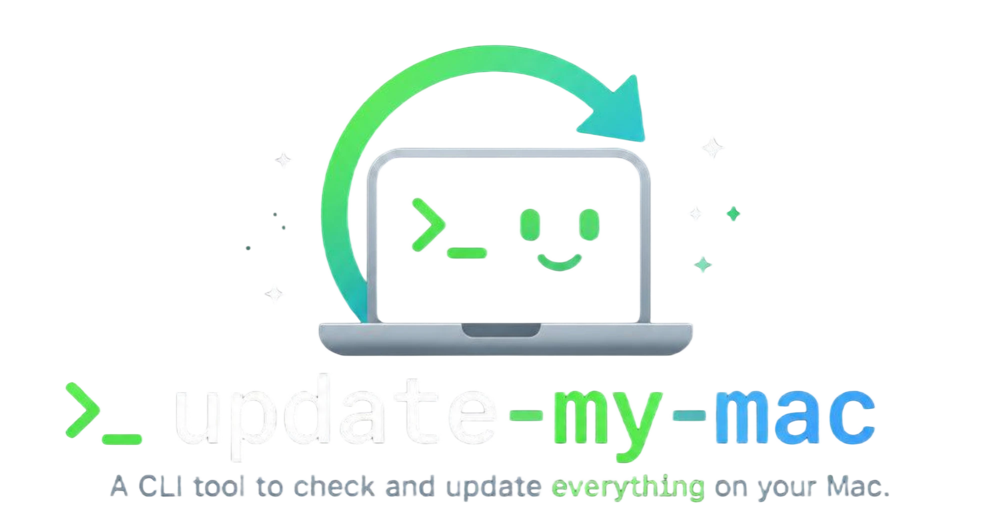

<p align="center">
  
</p>

<p align="center">&nbsp;&nbsp;&nbsp;<a href="https://github.com/a-mi-go/update-my-mac/actions/workflows/ci.yml"></a></p>

<p align="center">
  <a href="https://buymeacoffee.com/a.mi.go">
    
  </a>
</p>

---

> **Warning**
> Upgrading everything at once can break things. A new version of a package can
> pull in a change you were not ready for, and no upgrade asks whether your work
> still builds afterwards. This tool never upgrades without asking first, but
> what happens after you say yes is up to the package managers. Use it at your
> own risk.

update-my-mac is an interactive tool that checks and updates:
 - apps in your App Store
 - manually installed / untracked apps
 - stuff installed with various package managers
 - the package managers themselves


## Installation

```bash
git clone https://github.com/a-mi-go/update-my-mac.git
cd update-my-mac
./setup.sh
```

Setup asks what to call the command, or takes the name (alias) up front with `./setup.sh --name update-my-mac`.
Default name is `update`.

## Updating

```bash
git pull
```

The command runs from the clone, so there is nothing to reinstall.

## Usage

```bash
update
```

Or any other name you set during the setup! You can also rerun the `setup.sh` to set a different name.

After a report, you pick what should be updated and what should be left alone. Nothing runs before you answer, and updates run in your terminal, so a password prompt from `brew` or `mas` works as usual.

The tool can also be run in a cli mode if you prefer or want to integrate it in you own pipeline:
```bash
update --check        # report only, no questions, for scripts and cron jobs
update --retry-app    # list an app again that you chose to leave alone
update --background   # planned: unattended run for launchd, notify only
```

`--check` returns non-zero only when a check could not run, not when something is out of date.

## What it actually checks / updates

The package managers may or may not be installed. None of them is a requirement.

| Source | Commands | Notes |
| --- | --- | --- |
| [mas](https://github.com/mas-cli/mas) | `mas outdated` <br> `mas upgrade` | Mac App Store apps. |
| [Homebrew](https://github.com/Homebrew/brew) | `brew outdated` <br> `brew update` | Formulae. Runs with `HOMEBREW_NO_AUTO_UPDATE=1`, so a scheduled check does not pull a new index first. Upgrades with `brew upgrade`. |
| [npm](https://github.com/npm/cli) | `npm outdated -g --json`<br>`npm update -g` | Global packages. "--json" because npm exits 1 both when it finds updates and when it fails. |
| [pnpm](https://github.com/pnpm/pnpm) | `pnpm outdated -g --json`<br>`pnpm update -g` | Global packages. "--json" because npm exits 1 both when it finds updates and when it fails. |
| Installed apps | `Info.plist` in `/Applications` and `~/Applications` | Apps from a `.dmg` or `.pkg` belong to no manager, so they are listed, not upgraded. You can tell the tool to leave one alone. |

### Planned / WIP

<!-- planned-sources:start -->
`softwareupdate`, [Homebrew Cask](https://github.com/Homebrew/homebrew-cask), [MacPorts](https://github.com/macports/macports-base), [Yarn](https://github.com/yarnpkg/yarn), [Bun](https://github.com/oven-sh/bun), [uv](https://github.com/astral-sh/uv), [pipx](https://github.com/pypa/pipx), [RubyGems](https://github.com/rubygems/rubygems), [Cargo](https://github.com/rust-lang/cargo), [Nix](https://github.com/NixOS/nix).

The commands and the open questions behind each of these are in the [roadmap](docs/roadmap.md).
<!-- planned-sources:end -->


## Want to help with the development?

```bash
uv run pytest
```

Two layers, both run by CI on macOS and Linux. `tests/unit/` is pure logic with no mocking and no subprocesses. `tests/integration/` runs the real CLI against fake package managers that sit alone on `PATH`, with an empty `HOME`, so nothing installed on the machine takes part.


<div>
  Or alternatively just  
  <a href="https://buymeacoffee.com/a.mi.go">
     buy me a coffee ☕️
  </a>
</div>

## More

- [docs/setup.md](docs/setup.md): the command name, what setup does about an alias that would hide it,
where your decisions about apps are kept.
- [docs/roadmap.md](docs/roadmap.md): what is next and what is still undecided.

## License

MIT © a-mi-go
